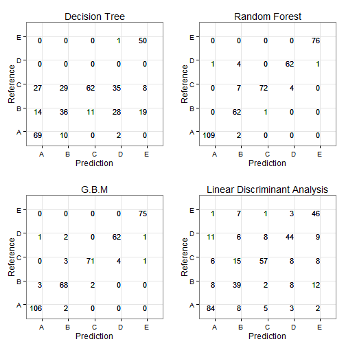
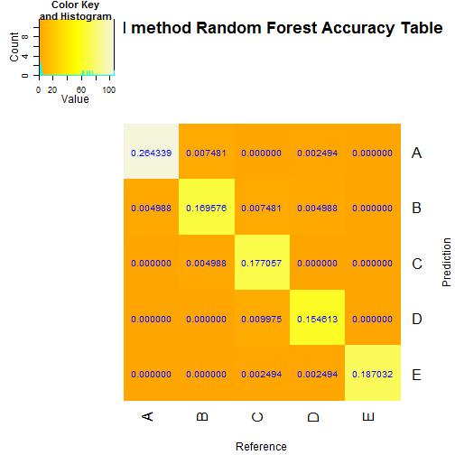

# Weight Lifting Exercise Classification Estimation

## Executive Summary

Using devices such as Jawbone Up, Nike FuelBand, and Fitbit it is now possible to collect a large amount of data about personal activity relatively inexpensively. These type of devices are part of the quantified self movement - a group of enthusiasts who take measurements about themselves regularly to improve their health, to find patterns in their behavior, or because they are tech geeks. One thing that people regularly do is quantify how much of a particular activity they do, but they rarely quantify how well they do it. The goal of this project will be to use data from accelerometers on the belt, forearm, arm, and dumbell of 6 participants of the study<sup>1</sup>. They were asked to perform barbell lifts correctly and incorrectly in 5 different ways. 

More information and data are available from the source website of the study<sup>1</sup>: http://groupware.les.inf.puc-rio.br/har
Velloso, E.; Bulling, A.; Gellersen, H.; Ugulino, W.; Fuks, H. **Qualitative Activity Recognition of Weight Lifting Exercises**. Proceedings of 4th International Conference in Cooperation with SIGCHI (Augmented Human '13). Stuttgart, Germany: ACM SIGCHI, 2013.

This paper attempts to describe the creation of a model which predicts "how well" a group of participants performed a weight lifting exercise and classifies their performance in five (5) classes.

Specifically, six young health participants were asked to perform one set of 10 repetitions of the Unilateral Dumbbell Biceps Curl in five different fashions: exactly according to the specification (Class A), throwing the elbows to the front (Class B), lifting the dumbbell only halfway (Class C), lowering the dumbbell only halfway (Class D) and throwing the hips to the front (Class E). Class A corresponds to the specified execution of the exercise, while the other 4 classes correspond to common mistakes.

The original data used may be found [here](http://groupware.les.inf.puc-rio.br/static/WLE/WearableComputing_weight_lifting_exercises_biceps_curl_variations.csv)

According to our research, the best results came from applying the **G.B.M.** prediction method, with an expected **Out of Sample Error** of approximately **__3%__**. 

## Data Processing

In order to train and test our model we used only a **__random subset__** of about 10% the original data. The original data may be found at [https://d396qusza40orc.cloudfront.net/predmachlearn/pml-training.csv](https://d396qusza40orc.cloudfront.net/predmachlearn/pml-training.csv).

Subsetting the data is useful for a number or reasons:
- It prevents overfitting of the prediction model to the data.
- It allows the R code to run on less powerfull computers.
- It decreases required computer resources.
- It saves time, as many advanced prediction models may be very computational intensive.

```r
# Set the working directory and the proper Locale
setwd("C:/Users/Zec/PML/pml")
Sys.setlocale(locale = "C")

# Please set working directory and the locale to appropriate values when
# reproducing this research.
```

              

```r
# Load required packages
require(reshape2)
require(caret)
require(kernlab)
require(rpart)
require(gbm)
require(survival)
require(splines)
require(parallel)
require(plyr)
require(MASS)
require(klaR)
require(gplots)
require(randomForest)
require(gridExtra)

# Read the data
trainfilename <- "pml-training.csv"
testfilename <- "pml-testing.csv"
wle <- read.csv(trainfilename, header = T, as.is = T)
origtest <- read.csv(testfilename, header = T)
```

For testing purposes, a set of test data has been provided. We used this test dataset to figure out how to clean the data that we would use to train our predictive models.


```r
# Set the seed, so that the research can be reproduced
set.seed(3356)

# Remove columns filled only with NA values
nonatest <- origtest[, !(apply(is.na(origtest[, colnames(origtest)]), 2, all))]

# Remove columns which are not of type Factor or Logical (exclude character
# or date columns)
wletest <- nonatest[!(sapply(nonatest, is.factor) + sapply(nonatest, is.logical))]

# Remove the last column the column which holds the results
wletest <- wletest[, -1]

# Find out which are the remaining columns in the test dataset and keep only
# the same columns in the training dataset
train_col_names <- colnames(wletest[, -ncol(wletest)])
origtrain <- read.csv(trainfilename, header = T)
wletrain <- origtrain[, train_col_names]

# Append the results column to the training dataset
wletrain$classe <- origtrain$classe

# As a precaution, keep only the rows with no NA values in the training
# dataset
nonawle <- wletrain[complete.cases(wletrain), ]
```

After reading and cleaning the data, we created a random subset of approximatelly 10% of the data. Subsequently, the random subset was split into three parts, one training dataset, one cross validation dataset and one test dataset with a ratio of 60% / 20% / 20%.

The creation of three independed datasets from the same random subset was a very important step. Having a training dataset and a cross validation dataset allowed us to train our models on the training dataset and then compare them by applying them on a new, unused, differnet dataset. This way we made sure that the comparison was done properly and that overfitting did not affect our results. The third (testing) dataset was used to compute the **Out of Sample error**. We opted to use a different dataset than the cross validation set, because using the cross validation set was bound to produce the best results, since all comparisons were done using that set.


```r
# Randomly subset approximately the 10% of the cleaned data
rand <- sample(nrow(nonawle), 2000)
randwle <- sample(nonawle[rand, ])

# Split the subsetted dataset into a training, a cross validation and a test
# set in a 60% / 20% / 20% ratio
dataidx <- createDataPartition(y = randwle$classe, p = 0.6, list = F)
wletr <- randwle[dataidx, ]
tsttemp <- randwle[-dataidx, ]
tstidx <- createDataPartition(y = tsttemp$classe, p = 0.5, list = F)
wlecv <- tsttemp[tstidx, ]
wletst <- tsttemp[-tstidx, ]
```

## Trying various predictive methods.

Having split the data in three parts, we applied our predictive methods on the first set of training data and created the predictive models, then run the results of each model on the cross validation set, chose the best model and applied it on the test set, in order to evaluate our results and estimate our out Of Sample error.

We used predictive models through the **train()** from the R **caret** package.

Our choice of models was:
- Decision Trees (rpart)
- Random Forest (rf)
- G.B.M (Boosting with trees)
- Linear Discriminant Analysis (lda)

Originally we have also chosen to use the **"Naive Bayes"** method, but it prooved to be extremely computational intensive and failed to run on our limited computer hardware resources, so it was abandoned.

We also chose not to evaluate the **"glm"** method, as this method is better for predicting continuous variables instead of discrete ones, like the __"classe"__ variable that we are trying to predict.


```r
# Apply different models to the data

rpartfit <- train(classe ~ ., data = wletr, method = "rpart")
rffit <- train(classe ~ ., data = wletr, method = "rf")
gbmfit <- train(classe ~ ., data = wletr, method = "gbm", verbose = F)
ldafit <- train(classe ~ ., data = wletr, method = "lda")
```

After creating our predictive models, we applied them to the cross validation set and examined the results, in order to compare the models and choose the best one. For implementing the prediction we used the **predict()** function from the R **caret** package, as well.

```r
# Predict outcome of the various methods based on the cross validation data
rpartpred <- predict(rpartfit, wlecv)
rfpred <- predict(rffit, wlecv)
gbmpred <- predict(gbmfit, wlecv)
ldapred <- predict(ldafit, wlecv)

# Create the Confusion Matrices
modrpart <- confusionMatrix(wlecv$classe, rpartpred)
modrf <- confusionMatrix(wlecv$classe, rfpred)
modgbm <- confusionMatrix(wlecv$classe, gbmpred)
modlda <- confusionMatrix(wlecv$classe, ldapred)
```

## Interpreting the results

In order to interpret the results, we first plotted the accuracy matrices of each model.


```r
# In order for the accuracy tables of the models to be plotted properly, the
# tables must be 'melted' into a long format
rpartmelt <- melt(modrpart$table)
rfmelt <- melt(modrf$table)
gbmmelt <- melt(modgbm$table)
ldamelt <- melt(modlda$table)

# Define a custom plotting function (for reasons of simplicity in coding)
modtabplot <- function(data, maintitle) {
    tabplot <- ggplot(data, aes(x = Prediction, y = Reference, label = value)) + 
        geom_text(size = 4, hjust = 1, vjust = 1)
    tabplot <- tabplot + geom_text(size = 4, hjust = 1, vjust = 1)
    tabplot <- tabplot + theme_bw()
    tabplot <- tabplot + ggtitle(maintitle)
    return(tabplot)
}

# Call the custom plotting function on each 'melted' model's table
rpartplot <- modtabplot(rpartmelt, "Decision Tree")
rfplot <- modtabplot(rfmelt, "Random Forest")
gbmplot <- modtabplot(gbmmelt, "G.B.M")
ldaplot <- modtabplot(ldamelt, "Linear Discriminant Analysis")

# Plot all tables in one image
grid.arrange(rpartplot, rfplot, gbmplot, ldaplot, nrow = 2, ncol = 2)
```

 


Inspecting the plots made it fairly easy to notice that the "Random Forest" and the "G.B.M" models produced the less prediction errors. However, these two models were extremely close to each other. This was also supported by the accuracy, reported by each model:


```r
METHOD = c("Random Forest", "Decision Tree", "G.B.M method", "Linear Discriminant Analysis")
Accuracy = c(modrf$overall[1], modrpart$overall[1], modgbm$overall[1], modlda$overall[1])
Model <- c("modrpart", "modrf", "modgbm", "modlda")
Fit <- c("rpartfit", "rffit", "gbmfit", "ldafit")
PredModels <- data.frame(METHOD, Accuracy, Model, Fit)

print(PredModels[, 1:2])
```

```
##                         METHOD Accuracy
## 1                Random Forest   0.9501
## 2                Decision Tree   0.5411
## 3                 G.B.M method   0.9526
## 4 Linear Discriminant Analysis   0.6733
```

```r
# Decide on the best method
bestmethod <- as.character(PredModels$METHOD[which.max(PredModels$Accuracy)])
bestmodel <- as.character(PredModels$Model[which.max(PredModels$Accuracy)])
bestfit <- as.character(PredModels$Fit[which.max(PredModels$Accuracy)])
bestaccuracy <- PredModels$Accuracy[which.max(PredModels$Accuracy)]
```

By comparing the models we decided that the **G.B.M method** had the highest accuracy. However, the difference in accuracy between the two top models was only about 0.2%, which lead us to the conclusion that perhaps in the furure, trying the same code with a different dataset, we could end up with a different accuracy order. 

Obviously, the two prediction methods produce equally good results on the specific data.

The accuracy rate of the **B.G.M** model for each exercise class may be seen in the following figure:


```r
my_color <- colorRampPalette(c("orange", "yellow", "beige"))(n = 1000)
accuracyrate <- format((get(bestmodel)$table/sum(get(bestmodel)$table)), digits = 4)
heatmap.2(get(bestmodel)$table, cellnote = accuracyrate, col = my_color, Rowv = NA, 
    dendrogram = "none", symm = T, scale = "none", trace = "none", notecol = "blue", 
    main = paste(bestmethod, "Random Forest Accuracy Table", sep = " "), ylab = "Prediction", 
    xlab = "Reference")
```

 


## Calculating the expected Out Of Sample Error.

After choosing the best model, we used the test dataset to estimate the expected out of sample error of the model. In order to do that we applied our chosen method to the test dataset and examined the accuracy estimation. 


```r
best_model_test <- predict(get(bestfit), wletst)
best_model_matrix <- confusionMatrix(wletst$classe, best_model_test)
print(best_model_matrix$overall[1])
```

```
## Accuracy 
##   0.9698
```

```r
outerr <- 1 - best_model_matrix$overall[1]
```


Considering that the error may be expressed as *1-accuracy*, we estimated that the G.B.M model has an **Out of Sample error** ~ **0.0302**.
